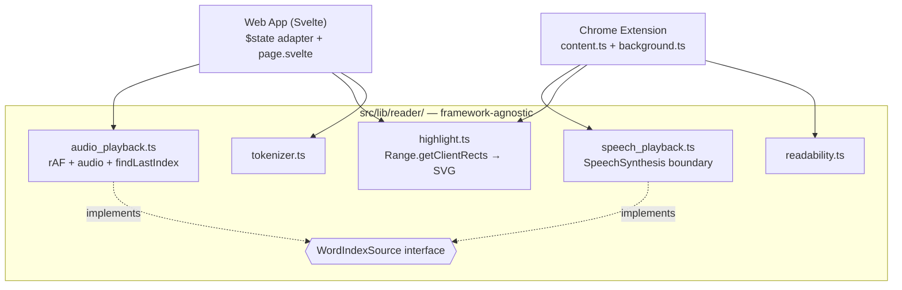
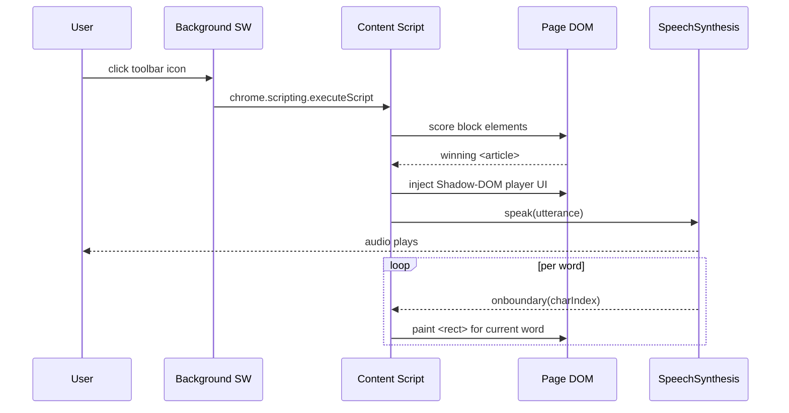
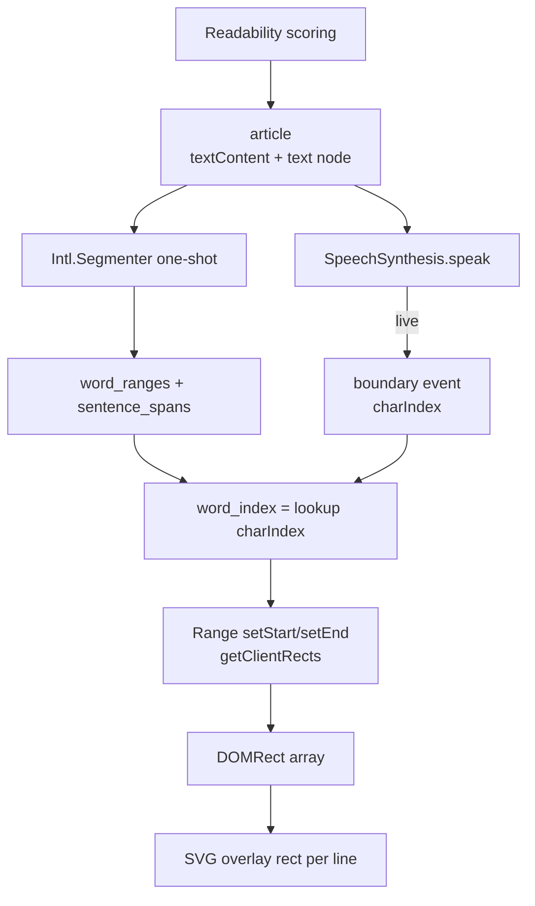

# System diagrams

Three views of the reader system: the **architecture** (what lives where),
the **runtime sequence** (what happens when the user clicks), and the
**data flow** (how a character offset becomes a painted rect).

Pre-rendered PNGs sit next to this file under `docs/diagrams/` —
double-click any of them in Finder. The Mermaid source below is the
ground truth; regenerate by running:

```bash
pnpm dlx @mermaid-js/mermaid-cli mmdc \
  -i docs/DIAGRAMS.md -o docs/diagrams/diagram.png
```

---

## 1. Architecture: shared core, two adapters

What lives where. The seam between framework-agnostic TS (used by both
the web app and the extension) and the two app shells. `WordIndexSource`
is the only abstraction that earns its keep — two implementations, one
shared downstream pipeline, no SDK boilerplate.



---

## 2. Runtime: extension click-to-read sequence

What happens when the user clicks the toolbar icon. Three actors in MV3
(background service worker, content script, page DOM) plus the browser's
TTS engine. The loop at the bottom is the live word-sync.



---

## 3. Data flow: charIndex → painted rect

The four data pieces in flight. Read top-to-bottom: readability picks an
article, the tokenizer (one-shot) gives word ranges, SpeechSynthesis
(live) emits charIndex per word, lookup turns it into a word_index, the
Range API turns that into geometry, the SVG paints it.



---

## How to use these in interview prep

- **Diagram 1** answers *"walk me through your codebase."* The defense:
  two consumers, one shared downstream pipeline, `WordIndexSource` is
  the only interface and it earns its keep.
- **Diagram 2** answers *"what happens when the user clicks the
  extension?"* The MV3 three-actor mental model. SW dies after 30 s
  idle; content script dies with the tab; only the page DOM persists.
- **Diagram 3** answers *"how does the highlight know where to paint?"*
  Character offset → word index → range → rects → SVG. Most candidates
  hand-wave this; doing it crisply is the senior signal.
